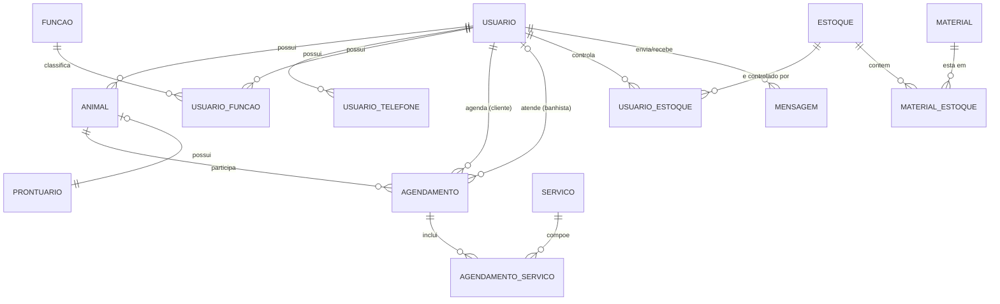

# Spec.md — API Petshop

> Documento de referência do backend. Deve ser lido por inteiro antes de qualquer implementação. Casos de uso não cobertos aqui exigem confirmação antes de serem assumidos — não decidir regra de negócio nova durante a codificação.

## Visão geral

O sistema é uma API REST para um petshop que precisa organizar o agendamento de banhos (e outros serviços) para os animais de seus clientes. Um cliente cadastra seus pets, agenda um ou mais serviços para uma data/hora, e a operação do estabelecimento (funcionários com papel de banhista) executa o atendimento. O objetivo central do domínio é eliminar a desorganização manual de agenda: evitar conflitos de horário, deixar claro quem atende cada animal, e manter um histórico (prontuário) por pet.

Um requisito de experiência do cliente é essencial ao domínio: o cliente deve ser notificado automaticamente quando o banho do seu animal **inicia** e quando **finaliza**, sem precisar ficar checando o status manualmente. Isso é tratado como um efeito de domínio (evento) disparado pela mudança de estado do agendamento, não como uma feature isolada.

De forma secundária, o sistema também administra papéis de usuário (cliente, banhista, admin), o catálogo de serviços oferecidos, e o controle de estoque de materiais usados nos banhos (shampoo, produtos, etc.), pois aparecem no domínio original e sustentam a operação do estabelecimento. Fora do escopo desta API: frontend, aplicativo mobile, pagamento online, e canais reais de push/SMS (a arquitetura deixa espaço para isso, mas o MVP notifica via um canal simples consultável por REST).

## Épicos

| # | Épico | Prioridade MVP | Depende de |
|---|-------|-----------------|------------|
| 1 | Autenticação e Gestão de Usuários | Essencial | — |
| 2 | Gestão de Pets (Animais e Prontuário) | Essencial | 1 |
| 3 | Catálogo de Serviços | Essencial | 1 |
| 4 | Agendamento de Banho e Serviços | Essencial | 1, 2, 3 |
| 5 | Execução do Atendimento | Essencial | 4 |
| 6 | Notificações ao Cliente | Essencial | 5 |
| 7 | Gestão de Estoque e Materiais | Desejável | 1 |
| 8 | Comunicação Direta (Mensagens) | Desejável | 1 |

---

### Épico 1 — Autenticação e Gestão de Usuários

**Descrição**: permite que pessoas se cadastrem no sistema, autentiquem via login (JWT) e tenham um ou mais papéis (cliente, banhista, admin) que determinam o que podem fazer na API. Sem isso, nenhum outro épico funciona.

**Condições de satisfação**:
- Dado um e-mail ainda não cadastrado, quando um usuário se cadastra com dados válidos, então uma conta é criada com a senha armazenada como hash (nunca em texto puro) e o papel padrão `CLIENTE` é atribuído.
- Dado um e-mail já cadastrado, quando alguém tenta se cadastrar novamente com o mesmo e-mail, então a operação falha com erro de conflito.
- Dado um CPF informado, quando já existir outro usuário com o mesmo CPF, então a operação falha com erro de conflito.
- Dado um usuário cadastrado, quando ele faz login com e-mail e senha corretos, então recebe um token JWT válido contendo seu id e seus papéis.
- Dado um login com senha incorreta, quando autenticar, então a operação falha com erro de não autorizado, sem indicar se o e-mail existe ou não.
- Dado um token JWT expirado ou inválido, quando usado em uma rota protegida, então a API responde com erro de não autorizado.
- Dado um usuário sem o papel exigido por uma rota (ex.: `BANHISTA` ou `ADMIN`), quando tenta acessá-la, então a API responde com erro de acesso proibido.
- Dado um admin, quando atribui um papel adicional a um usuário (ex.: tornar um usuário também `BANHISTA`), então o novo papel passa a valer nas próximas autenticações.

**Casos de uso envolvidos**:
- `CadastrarUsuario`
- `AutenticarUsuario`
- `AtribuirFuncaoUsuario`
- `CadastrarTelefoneUsuario`
- `AtualizarUsuario`
- `ListarUsuarios` (uso administrativo)

**Regras de negócio relevantes**:
- E-mail é único e obrigatório; CPF é único quando informado, mas não obrigatório.
- Senha nunca é persistida nem logada em texto puro; exige no mínimo 8 caracteres.
- Papéis possíveis no MVP: `CLIENTE`, `BANHISTA`, `ADMIN` (conjunto fechado, cadastrado via seed — criar novos papéis não é exposto por API nesta etapa).
- Todo usuário nasce com o papel `CLIENTE`; papéis adicionais só são atribuídos por um `ADMIN`.
- Um usuário pode ter várias funções (ex.: ser `CLIENTE` e `BANHISTA` ao mesmo tempo) e vários telefones.

**Status**:
- [x] Não iniciado
- [ ] Em andamento
- [ ] Concluído

---

### Épico 2 — Gestão de Pets (Animais e Prontuário)

**Descrição**: permite que um cliente cadastre seus animais e que a equipe do petshop registre o histórico de saúde/cuidados (prontuário) de cada um.

**Condições de satisfação**:
- Dado um cliente autenticado, quando cadastra um animal com nome e espécie, então o animal passa a existir vinculado a esse cliente.
- Dado um animal que não pertence ao usuário autenticado, quando esse usuário tenta editá-lo ou consultá-lo (sem ser `ADMIN`/`BANHISTA`), então a operação falha com erro de acesso proibido.
- Dado um animal sem prontuário, quando um `BANHISTA`/`ADMIN` registra um prontuário para ele, então passa a existir exatamente um prontuário associado a esse animal.
- Dado um animal que já tem prontuário, quando alguém tenta registrar um novo prontuário para o mesmo animal, então a operação falha (deve-se atualizar o existente, não duplicar).

**Casos de uso envolvidos**:
- `CadastrarAnimal`
- `AtualizarAnimal`
- `ListarAnimaisDoCliente`
- `RegistrarProntuario`
- `AtualizarProntuario`
- `ConsultarProntuario`

**Regras de negócio relevantes**:
- Um animal pertence a exatamente um usuário (dono).
- Um animal tem no máximo um prontuário (0..1); o prontuário não existe de forma independente de um animal.
- Apenas o dono do animal, ou usuários com papel `BANHISTA`/`ADMIN`, podem consultar/alterar o animal e seu prontuário.

**Status**:
- [x] Não iniciado
- [ ] Em andamento
- [ ] Concluído

---

### Épico 3 — Catálogo de Serviços

**Descrição**: mantém a lista de serviços que o petshop oferece (banho, tosa, etc.), com preço e duração, usados na hora de montar um agendamento.

**Condições de satisfação**:
- Dado um `ADMIN` autenticado, quando cria um serviço com nome, preço ≥ 0 e duração > 0, então o serviço passa a estar disponível para agendamento.
- Dado um serviço com preço negativo ou duração ≤ 0, quando alguém tenta criá-lo ou atualizá-lo, então a operação falha com erro de validação.
- Dado qualquer usuário autenticado, quando lista os serviços, então recebe apenas os serviços ativos.
- Dado um serviço já usado em algum agendamento, quando um `ADMIN` tenta removê-lo, então o serviço é inativado (não excluído fisicamente), preservando o histórico dos agendamentos que o referenciam.

**Casos de uso envolvidos**:
- `CriarServico`
- `AtualizarServico`
- `InativarServico`
- `ListarServicos`

**Regras de negócio relevantes**:
- Preço ≥ 0; duração em minutos > 0.
- Serviços não são excluídos fisicamente quando já usados em algum agendamento (soft delete via flag `ativo`), para não quebrar o histórico.
- Apenas `ADMIN` cria/atualiza/inativa serviços; qualquer usuário autenticado pode listá-los.

**Status**:
- [x] Não iniciado
- [ ] Em andamento
- [ ] Concluído

---

### Épico 4 — Agendamento de Banho e Serviços

**Descrição**: o núcleo do sistema — permite que um cliente marque um horário para um ou mais serviços em um de seus animais, evitando conflitos de agenda para quem vai atender.

**Condições de satisfação**:
- Dado um cliente autenticado com um animal cadastrado, quando cria um agendamento para uma data/hora futura com ao menos um serviço, então o agendamento é criado com status `AGENDADO`.
- Dado um agendamento sem nenhum serviço associado, quando é criado, então a operação falha com erro de validação (agendamento precisa de ao menos 1 serviço).
- Dado um horário no passado, quando alguém tenta agendar nele, então a operação falha com erro de validação.
- Dado um banhista com um agendamento já confirmado num intervalo de horário, quando outro agendamento é atribuído a ele em horário sobreposto, então a operação falha com erro de conflito.
- Dado um agendamento com status `AGENDADO`, quando o cliente dono ou um `ADMIN` o cancela, então o status muda para `CANCELADO` e o horário libera a agenda do banhista.
- Dado um agendamento com status diferente de `AGENDADO` (já iniciado, finalizado ou cancelado), quando alguém tenta cancelá-lo ou reagendá-lo, então a operação falha com erro de regra de negócio.
- Dado um cliente autenticado, quando lista seus agendamentos, então vê apenas os agendamentos onde ele é o cliente.
- Dado um banhista autenticado, quando lista sua agenda, então vê apenas os agendamentos onde ele é o banhista atribuído.

**Casos de uso envolvidos**:
- `CriarAgendamento`
- `AdicionarServicoAoAgendamento`
- `AtribuirBanhistaAoAgendamento`
- `ReagendarAgendamento`
- `CancelarAgendamento`
- `ListarAgendamentosDoCliente`
- `ListarAgendaDoBanhista`

**Regras de negócio relevantes**:
- Status possíveis do agendamento: `AGENDADO` → `EM_ANDAMENTO` → `FINALIZADO`, ou `AGENDADO` → `CANCELADO`. Nenhuma outra transição é permitida.
- Um agendamento sempre tem cliente e animal definidos na criação; **o banhista pode ser definido depois** (na criação o agendamento pode ficar sem banhista atribuído — a atribuição é uma operação separada, `AtribuirBanhistaAoAgendamento`), mas é **obrigatório** ter um banhista atribuído antes de poder iniciar o atendimento (Épico 5).
- Dois agendamentos do mesmo banhista não podem se sobrepor no tempo (data/hora + soma da duração dos serviços incluídos).
- Um agendamento precisa de no mínimo 1 serviço associado.
- O animal do agendamento deve pertencer ao cliente do agendamento.

**Status**:
- [x] Não iniciado
- [ ] Em andamento
- [ ] Concluído

---

### Épico 5 — Execução do Atendimento

**Descrição**: representa o ciclo de vida operacional do banho no dia do atendimento — o banhista marca quando começa e quando termina. É esse evento que dispara a notificação ao cliente (Épico 6).

**Condições de satisfação**:
- Dado um agendamento `AGENDADO` com banhista atribuído, quando o próprio banhista (ou um `ADMIN`) inicia o atendimento, então o status muda para `EM_ANDAMENTO` e um evento de domínio `AgendamentoIniciado` é emitido.
- Dado um agendamento `AGENDADO` sem banhista atribuído, quando alguém tenta iniciar o atendimento, então a operação falha com erro de regra de negócio.
- Dado um agendamento que não está `EM_ANDAMENTO`, quando alguém tenta finalizá-lo, então a operação falha com erro de regra de negócio.
- Dado um agendamento `EM_ANDAMENTO`, quando o banhista responsável (ou um `ADMIN`) finaliza o atendimento, então o status muda para `FINALIZADO` e um evento de domínio `AgendamentoFinalizado` é emitido.
- Dado um usuário que não é o banhista responsável nem `ADMIN`, quando tenta iniciar ou finalizar um atendimento, então a operação falha com erro de acesso proibido.

**Casos de uso envolvidos**:
- `IniciarBanho`
- `FinalizarBanho`

**Regras de negócio relevantes**:
- Só o banhista atribuído ao agendamento (ou um `ADMIN`) pode iniciar/finalizar o atendimento.
- Transição só é válida na ordem `AGENDADO → EM_ANDAMENTO → FINALIZADO`; qualquer tentativa fora dessa ordem é rejeitada.
- A emissão dos eventos de domínio é parte da mesma operação (mesma transação lógica de mudança de status), mas o **envio** da notificação em si é tratado de forma desacoplada pelo Épico 6 — se o envio falhar, a mudança de status já efetivada não deve ser desfeita.

**Status**:
- [x] Não iniciado
- [ ] Em andamento
- [ ] Concluído

---

### Épico 6 — Notificações ao Cliente

**Descrição**: garante que o dono do animal saiba, sem precisar perguntar, quando o banho do seu pet começou e quando terminou.

**Condições de satisfação**:
- Dado um evento `AgendamentoIniciado`, quando ele é processado, então uma notificação é registrada para o cliente dono do agendamento com um texto informando o início do atendimento.
- Dado um evento `AgendamentoFinalizado`, quando ele é processado, então uma notificação é registrada para o cliente dono do agendamento com um texto informando o fim do atendimento.
- Dado um cliente autenticado, quando consulta suas notificações, então recebe apenas as suas, ordenadas da mais recente para a mais antiga.
- Dado um canal de envio de notificação indisponível, quando `IniciarBanho`/`FinalizarBanho` são executados, então a transição de status do agendamento ocorre normalmente (a notificação não pode bloquear nem reverter a operação principal).

**Casos de uso envolvidos**:
- `NotificarInicioBanho`
- `NotificarFimBanho`
- `ListarNotificacoesDoUsuario`

**Regras de negócio relevantes**:
- A notificação é sempre direcionada ao cliente (dono do agendamento), nunca ao banhista.
- O disparo é assíncrono/desacoplado do caso de uso que muda o status (via dispatcher de eventos de domínio — ver Decisões técnicas), para não acoplar a lógica de agendamento à lógica de envio.
- No MVP, a notificação é persistida (reaproveitando a entidade `Mensagem`, com remetente "sistema" e tipo `NOTIFICACAO`) e consultada via polling REST; não há push real (ver Decisões técnicas para o motivo e o caminho de evolução).

**Status**:
- [x] Não iniciado
- [ ] Em andamento
- [ ] Concluído

---

### Épico 7 — Gestão de Estoque e Materiais (desejável)

**Descrição**: controla os materiais usados nos banhos (shampoo, produtos etc.) e em quais estoques/locais eles estão, com quem é responsável por cada estoque.

**Condições de satisfação**:
- Dado um `ADMIN`, quando cria um estoque com nome, então o estoque passa a existir vazio (sem materiais).
- Dado um material e um estoque existentes, quando uma entrada é registrada, então a quantidade daquele material naquele estoque aumenta na quantidade informada.
- Dado uma saída maior que a quantidade disponível, quando é registrada, então a operação falha com erro de regra de negócio (estoque não pode ficar negativo).
- Dado um usuário atribuído a um estoque, quando consulta o saldo desse estoque, então vê a quantidade atual de cada material nele.

**Casos de uso envolvidos**:
- `CriarEstoque`
- `CriarMaterial`
- `RegistrarEntradaEstoque`
- `RegistrarSaidaEstoque`
- `AtribuirUsuarioAoEstoque`
- `ConsultarSaldoEstoque`

**Regras de negócio relevantes**:
- A quantidade de um material é sempre relativa a um estoque específico (não existe "quantidade" solta em `Material`).
- Quantidade de um material em um estoque nunca fica negativa.
- Um estoque pode ter vários usuários responsáveis, e um usuário pode responder por vários estoques.

**Status**:
- [x] Não iniciado
- [ ] Em andamento
- [ ] Concluído

---

### Épico 8 — Comunicação Direta (Mensagens) (desejável)

**Descrição**: permite troca de mensagens diretas entre cliente e petshop, reaproveitando a mesma entidade usada pelas notificações automáticas (Épico 6), diferenciadas por tipo.

**Condições de satisfação**:
- Dado dois usuários autenticados, quando um envia uma mensagem ao outro, então ela é registrada com tipo `MANUAL`, remetente e destinatário corretos.
- Dado um usuário autenticado, quando lista sua conversa com outro usuário, então vê as mensagens trocadas entre os dois, em ordem cronológica.

**Casos de uso envolvidos**:
- `EnviarMensagem`
- `ListarConversaDoUsuario`

**Regras de negócio relevantes**:
- Mensagens `MANUAL` sempre têm remetente humano; mensagens `NOTIFICACAO` (Épico 6) podem ter remetente nulo (sistema).
- Um usuário só pode listar conversas das quais participa.

**Status**:
- [x] Não iniciado
- [ ] Em andamento
- [ ] Concluído

---

## Modelo de domínio

Baseado nos DERs em `.docs/`, com os ajustes abaixo já aplicados (resolvendo as inconsistências identificadas na revisão dos diagramas):

- `Funcao` não carrega mais `usuario_id` (o vínculo é só via `usuario_funcao`, N:N).
- `Estoque` usa `nome` (não `tipo`) como no DER Físico.
- `quantidade` vive em `material_estoque` (não em `Material`), pois é relativa ao par material+estoque.
- `Usuario` tem telefones em tabela separada `usuario_telefone` (1:N), não como atributo escalar.
- `banhista_id` em `Agendamento` é **opcional na criação** e se torna obrigatório apenas para a transição `AGENDADO → EM_ANDAMENTO` (regra de aplicação, não constraint `NOT NULL` no banco — ver Épico 4/5).
- `Estoque` existe como entidade intermediária entre `Usuario` e `Material` (o DER Conceitual, que ligava `Usuario` a `Material` direto, estava simplificado demais e não é usado como referência).
- `Mensagem` ganha um campo `tipo` (`MANUAL` | `NOTIFICACAO`) para servir tanto ao Épico 6 quanto ao Épico 8, com `remetente_id` opcional (nulo = sistema).



| Entidade | Campos principais | Observações |
|---|---|---|
| `usuario` | id, nome, email (único), senha_hash, cpf (único, opcional) | |
| `funcao` | id, nome (único) | seed: `CLIENTE`, `BANHISTA`, `ADMIN` |
| `usuario_funcao` | id, usuario_id, funcao_id | único por (usuario_id, funcao_id) |
| `usuario_telefone` | id, usuario_id, telefone | 1 usuário : N telefones |
| `animal` | id, usuario_id, nome, especie, raca | dono obrigatório |
| `prontuario` | id, animal_id (único), historico, vacinas | 0..1 por animal |
| `servico` | id, nome, preco, duracao_minutos, ativo | soft delete via `ativo` |
| `agendamento` | id, cliente_id, banhista_id (nulo até atribuição), animal_id, data, hora, status | status: `AGENDADO`\|`EM_ANDAMENTO`\|`FINALIZADO`\|`CANCELADO` |
| `agendamento_servico` | id, agendamento_id, servico_id | único por (agendamento_id, servico_id) |
| `estoque` | id, nome | |
| `material` | id, nome, tipo | |
| `material_estoque` | id, material_id, estoque_id, quantidade | quantidade ≥ 0 |
| `usuario_estoque` | id, usuario_id, estoque_id | responsáveis por estoque |
| `mensagem` | id, remetente_id (opcional), destinatario_id, conteudo, tipo, data_envio | tipo: `MANUAL`\|`NOTIFICACAO` |

## Decisões técnicas e stack

| Decisão | Escolha | Motivo |
|---|---|---|
| Runtime | Node.js LTS (≥ 20) | padrão atual, suporte ESM nativo |
| Módulos | ESM (`"type": "module"`) | sintaxe moderna, sem transpilação |
| Framework HTTP | Express.js | maduro, simples, baixa curva de aprendizado — adequado ao ritmo de hackathon; fica isolado na camada `interfaces/` |
| Persistência | PostgreSQL | fixado pelo escopo |
| Acesso a dados | Prisma (Client + Migrate) | migrations rápidas e client seguro; usado **somente** dentro de `infrastructure/database`, nunca importado por domínio/aplicação |
| Validação de entrada HTTP | Zod | schemas declarativos, usados nos controllers/middlewares, fora do domínio |
| Autenticação | JWT (`jsonwebtoken`) + `bcrypt` para hash de senha | fixado pelo escopo (JWT); bcrypt é o padrão de mercado para hash de senha em Node |
| Autorização | Middleware de papel (`exigirFuncao(['ADMIN'])`) lendo claims do JWT | evita checagem de papel espalhada pelos casos de uso |
| Eventos de domínio | `EventEmitter` nativo do Node, atrás de uma interface `EventDispatcher` (port) | desacopla `IniciarBanho`/`FinalizarBanho` do envio de notificação; trocável por fila real (ex. BullMQ) sem tocar nos casos de uso |
| Notificações | Port `NotificationSender`; implementação inicial grava em `mensagem` (tipo `NOTIFICACAO`), consultada via `GET /api/v1/notificacoes` | push/e-mail/SMS reais exigem infraestrutura externa fora do prazo de hackathon; a interface já deixa o ponto de extensão pronto |
| Testes | Jest + repositórios in-memory implementando os ports do domínio | casos de uso testáveis sem banco nem HTTP, conforme escopo |
| Logger | pino | log estruturado, leve |
| Config/env | `dotenv` + validação em `shared/config/env.js` | falha rápido se faltar variável obrigatória |
| Injeção de dependência | composition root manual em `infrastructure/container.js` | sem framework de DI — escopo não justifica a complexidade extra |
| IDs | inteiros autoincrementais (via Prisma), como nos DERs originais | evita divergir do modelo já validado sem necessidade concreta para o MVP |
| Versionamento de API | prefixo `/api/v1` | ver Convenções |

## Estrutura de pastas

```
src/
  domain/
    entities/
      Usuario.js
      Animal.js
      Prontuario.js
      Servico.js
      Agendamento.js
      Estoque.js
      Material.js
      Mensagem.js
      Funcao.js
    value-objects/
      Email.js
      Cpf.js
      Telefone.js
      StatusAgendamento.js
      Dinheiro.js
    events/
      AgendamentoIniciadoEvent.js
      AgendamentoFinalizadoEvent.js
    errors/
      DomainError.js
      ValidationError.js
      NotFoundError.js
      ConflictError.js
      BusinessRuleError.js
    repositories/            # ports (interfaces)
      UsuarioRepository.js
      AnimalRepository.js
      ServicoRepository.js
      AgendamentoRepository.js
      EstoqueRepository.js
      MaterialRepository.js
      MensagemRepository.js

  application/
    usecases/
      usuario/
        CadastrarUsuario.js
        AutenticarUsuario.js
        AtribuirFuncaoUsuario.js
        CadastrarTelefoneUsuario.js
      animal/
        CadastrarAnimal.js
        RegistrarProntuario.js
        ...
      servico/
        CriarServico.js
        ...
      agendamento/
        CriarAgendamento.js
        AtribuirBanhistaAoAgendamento.js
        CancelarAgendamento.js
        IniciarBanho.js
        FinalizarBanho.js
      notificacao/
        NotificarInicioBanho.js
        NotificarFimBanho.js
        ListarNotificacoesDoUsuario.js
      estoque/
        ...
    dtos/
      usuario/
      agendamento/
      ...
    ports/                   # interfaces que não são repositórios
      HashProvider.js
      TokenProvider.js
      NotificationSender.js
      EventDispatcher.js

  infrastructure/
    database/
      prisma/
        schema.prisma
      repositories/
        PrismaUsuarioRepository.js
        PrismaAgendamentoRepository.js
        ...
    security/
      BcryptHashProvider.js
      JwtTokenProvider.js
    events/
      NodeEventDispatcher.js
    notifications/
      MensagemNotificationSender.js
    logger/
      pinoLogger.js
    container.js              # composition root

  interfaces/
    http/
      app.js
      server.js
      routes/
        index.js
        usuarioRoutes.js
        animalRoutes.js
        servicoRoutes.js
        agendamentoRoutes.js
        notificacaoRoutes.js
        estoqueRoutes.js
      controllers/
        UsuarioController.js
        AgendamentoController.js
        ...
      middlewares/
        authMiddleware.js
        exigirFuncao.js
        errorHandler.js
        validate.js
      validators/              # schemas Zod
        usuarioSchemas.js
        agendamentoSchemas.js
        ...

  shared/
    config/
      env.js

tests/
  unit/
    domain/
    application/
  fakes/
    InMemoryUsuarioRepository.js
    InMemoryAgendamentoRepository.js
    ...

.env.example
package.json
```

Regra de dependência (Clean Architecture): `domain` não importa nada de `application`, `infrastructure` ou `interfaces`. `application` importa de `domain`, nunca de `infrastructure`/`interfaces`. `infrastructure` e `interfaces` importam de `application`/`domain` para implementar as interfaces (ports) e expor as rotas — nunca o contrário.

## Convenções

**Nomenclatura**
- Casos de uso: `VerboSubstantivo` (ex.: `CriarAgendamento`, `IniciarBanho`), um arquivo por caso de uso, classe com método público `execute(input)`.
- Entidades de domínio: substantivo singular em português, igual aos DERs (`Usuario`, `Agendamento`, `Servico`...).
- Arquivos de classe: PascalCase (`Usuario.js`). Arquivos utilitários/rotas: camelCase (`agendamentoRoutes.js`).

**Padrão de erros**
- Hierarquia em `domain/errors`: `DomainError` (base) → `ValidationError`, `NotFoundError`, `ConflictError`, `BusinessRuleError`. Erros de autenticação/autorização (`UnauthorizedError`, `ForbiddenError`) também estendem `DomainError`.
- Casos de uso e entidades lançam esses erros; nunca lançam `Error` genérico nem erros específicos de HTTP.
- Um único middleware (`interfaces/http/middlewares/errorHandler.js`) traduz erro de domínio → status HTTP. Mapeamento:
  - `ValidationError` → 400
  - `UnauthorizedError` → 401
  - `ForbiddenError` → 403
  - `NotFoundError` → 404
  - `ConflictError` → 409
  - `BusinessRuleError` → 422
  - não tratado → 500 (logado, mensagem genérica ao cliente)

**Padrão de resposta HTTP**
- Sucesso: `{ "data": ... }`; listas paginadas: `{ "data": [...], "meta": { "page": 1, "pageSize": 20, "total": 42 } }`.
- Erro: `{ "error": { "code": "BUSINESS_RULE_ERROR", "message": "...", "details": [...] } }`.
- Datas trafegam em ISO-8601 UTC.

**Versionamento de API**
- Todas as rotas sob `/api/v1`. Mudança incompatível de contrato exige novo prefixo (`/api/v2`), nunca alterar o contrato de uma rota já publicada em `v1`.

**Autenticação**
- Header `Authorization: Bearer <token>`.
- Claims mínimas do JWT: `sub` (id do usuário), `funcoes` (array de papéis).
- Expiração configurável via `JWT_EXPIRES_IN` (padrão sugerido: 1h). Refresh token está fora do MVP.
